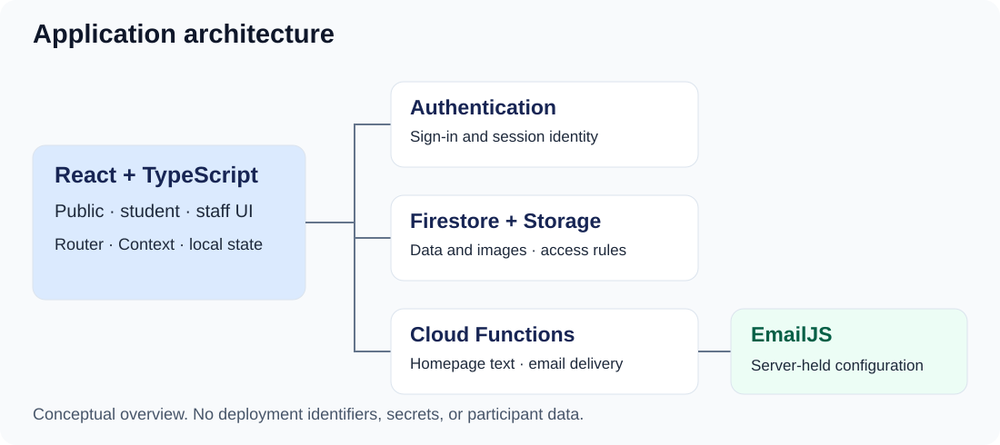

# Socio HR Play

**Interactive assessments and outreach activities for a university audience.** A web application built for the Faculty of Sociology and Social Work at the West University of Timișoara, combining a public activity catalogue with student accounts and tools for staff to manage content and review participation.

[Explore the live application](https://uvt-socio-quiz.web.app/) · [Recruiter walkthrough](docs/walkthrough.md) · [Engineering notes](docs/engineering.md) · [Verification](docs/verification.md)

> Local review draft. The client has authorized a public case study, live link, application screenshots, institution name, and logos. This exact repository remains local until its final content review. The application interface is primarily Romanian.

## My contribution

**Alexandru Lungu — Full-Stack Developer, contract, October 2025–March 2026.**

I was the sole software developer. I designed and implemented the React/TypeScript interface, reusable activity constructor and activity logic, Firebase integration, authenticated student and staff workflows, administration tools, image processing, and deployment support. Three other team members supplied product and activity ideas and authored the quizzes through the constructor I built. They owned the subject-matter content; I do not claim authorship of their questions, answers, assessment methodology, or institutional branding.

## Problem and users

The application supports the Faculty of Sociology and Social Work at the West University of Timișoara in offering interactive sociology and HR-related activities to prospective students and other visitors, while giving its team a way to create and maintain activities and review participation. The CV describes use at outreach events; attendance, adoption, and impact were not independently verified.

| Audience | Implemented journey |
| --- | --- |
| Visitor | Browse published activities, open an introduction, answer questions, and view a supported quiz result without an account. |
| Student | Register or sign in, complete activities, view assessment history, and update a profile. |
| Administrator | Create and edit activities, manage publication and ordering, inspect participation, and export questionnaire responses. |
| Super administrator | Additional permission to promote or demote ordinary administrators. |

Five activity formats are implemented: **graded assessment, personality, multiple intelligences, crossword, and questionnaire**. During review, the public catalogue demonstrated personality activities. Protected operations and the other formats were assessed in source, not exercised against client records.

## A two-minute look

1. Open the live application and choose **Vezi Chestionarele** or **Programe** to browse without an account.
2. Open an activity and choose **Începe** to inspect the question interface. Return to the catalogue when finished exploring.
3. Use the [synthetic screen walkthrough](docs/walkthrough.md) to understand the student and staff workflows. No shared credentials are published.

The hosted application contains real client content. Questionnaire submission records responses, and account creation or emailed results changes client data. The review did not submit these forms. A guest result-without-saving path exists for scored/outcome quizzes; it is not a promise that every activity is a sandbox.

## Engineering

**React 19, TypeScript, Vite, React Router, Tailwind CSS, Radix UI, Firebase Auth/Firestore/Storage/Cloud Functions/Hosting, Recharts, Zod, and EmailJS.** Component state handles activity progress; React Context shares authentication; Firestore services handle reads and administration. A callable function validates submissions, recomputes results, persists records, and requests email delivery. Recharts renders student score history. These are observed uses, not a reconstructed technology-selection history.

The [engineering notes](docs/engineering.md) explain three concrete tradeoffs: shared activity types with server-verified scoring; resilient homepage reads; and idempotent guest submission with separated contact and completion records. They also describe the limits of these approaches.

## Quality, outcomes, and status

The hardened private revision passes lint, both production builds, **17 automated tests**, Firebase emulator authorization tests, and high-severity production dependency audit gates. GitHub Actions repeated these checks successfully on Node.js 22 and Java 21. See [exact scope and results](docs/verification.md).

The verified outcome is a hosted public catalogue and guest introduction/question flow backed by an implementation of student and administrative workflows. No conversion gains, adoption totals, measured performance improvements, psychometric validity, or compliance guarantees are claimed.

The local revision tightens profile and image authorization, moves submission validation and scoring to a rate-limited idempotent server transaction, adds App Check enforcement, fixes key loading/error/accessibility states, and splits route bundles. These changes are not deployed. App Check configuration, a coordinated Firebase release, synthetic post-release checks, operator approval of retention terms, and protected-role browser QA remain outstanding. Published activity documents still expose their answer mappings, so the product should be treated as a low-stakes educational tool rather than a secure examination system.

## Source and rights

**The application source remains private because this is client work.** This repository contains only case-study writing and original synthetic illustrations; it contains no application source, credentials, participant data, or client artwork.

© 2026 Alexandru Lungu. All rights reserved for case-study material owned by Alexandru Lungu. Client software, branding, content, and third-party materials remain the property of their respective rights holders. See [rights and publication review](docs/publication-review.md) and [LICENSE](LICENSE).

**Professional profile:** [Alexandru Lungu on GitHub](https://github.com/Saandu). Additional contact links are withheld until their public destination can be verified.
