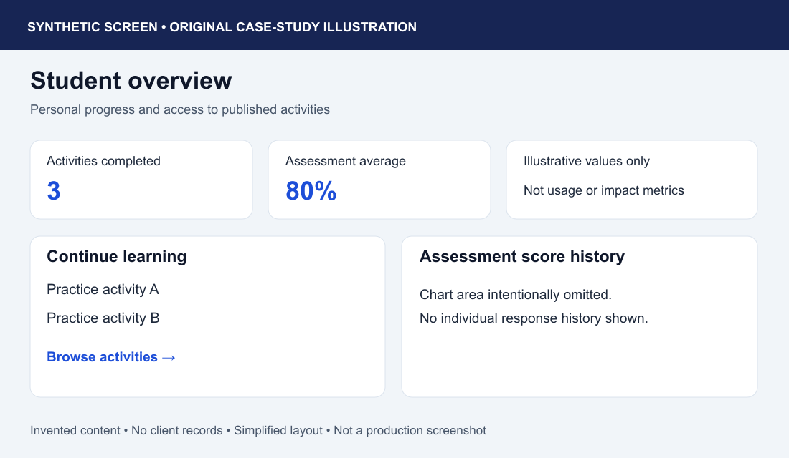
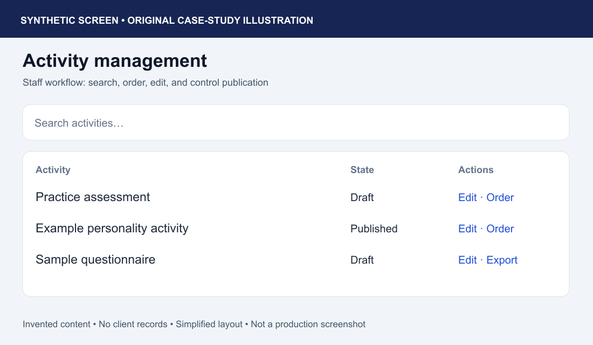
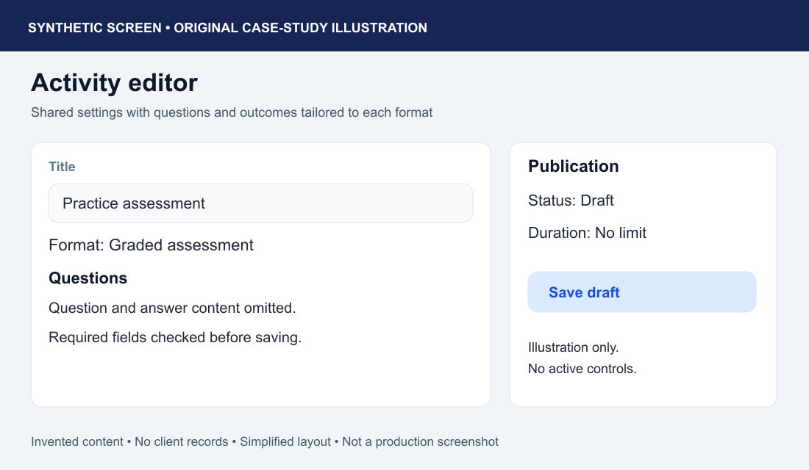

# Recruiter walkthrough

## Public application: about two minutes

Open [Socio HR Play](https://uvt-socio-quiz.web.app/). The interface is primarily Romanian, and current client content may change.

| Step | Visible label | What to inspect |
| --- | --- | --- |
| Browse | Vezi Chestionarele / Programe | Published activity cards, descriptions, type, and question count. No account required. |
| Open | Începe Chestionarul | Activity introduction and return control. |
| Begin | Începe | Question, choices, progress, and previous/next controls. This opening flow was observed live. |
| Exit | Close control | Return to the catalogue without completing the activity. |

Do not use the hosted application as a disposable test database. No shared student or administrator account is provided. Registration, questionnaire completion, and requesting an emailed result can write data or send email. The guest option **Vezi rezultatul fără salvare** is implemented for the separate quiz result flow; full completion was not tested in this review.

## Protected workflows: synthetic screen walkthrough

The following PNGs are **original synthetic screen illustrations**, not screenshots of the client application or proof of a successful protected workflow. They deliberately simplify the interface and use invented activity titles and aggregate values. There are no participant records, contact details, real answers, client logos, or live database connections.

### Student overview

The implementation loads the signed-in student's saved results and published activities, calculates assessment statistics, and offers activities to continue. A score chart is implemented. Live account creation, saving, and historical data were not tested.

### Staff activity management

The staff interface provides activity search, edit/create actions, draft/published/archived state, manual ordering, and questionnaire CSV export. The illustration shows only invented catalogue entries. No client activity was edited, published, exported, or deleted during review.

### Activity authoring

The editor shares basic activity settings while exposing format-specific questions, outcomes, and image handling. Client assessment content and answer keys are omitted. The save and publish controls in this illustration are descriptive and have no functionality.

## What these materials demonstrate

The live review supports the public catalogue and first-question flow. Source review supports the existence of protected features. The illustrations support discussion of those workflows without claiming that a production administrator session was demonstrated. A full protected demo would require an isolated environment with synthetic fixtures and validated access rules; that environment has not been built.
